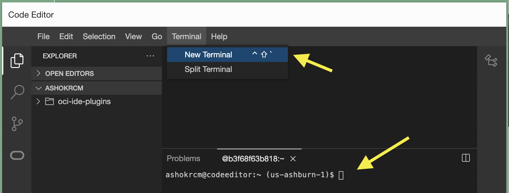
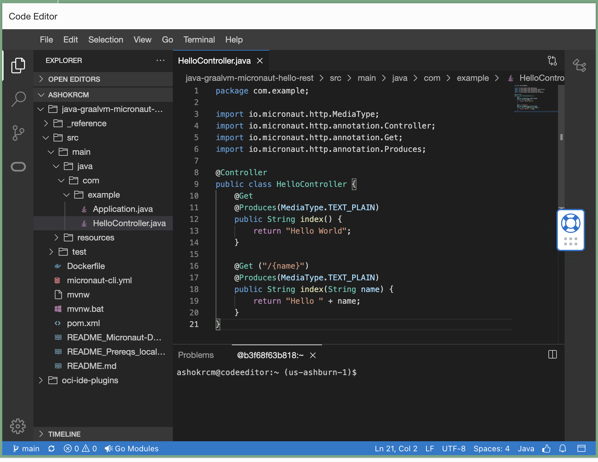
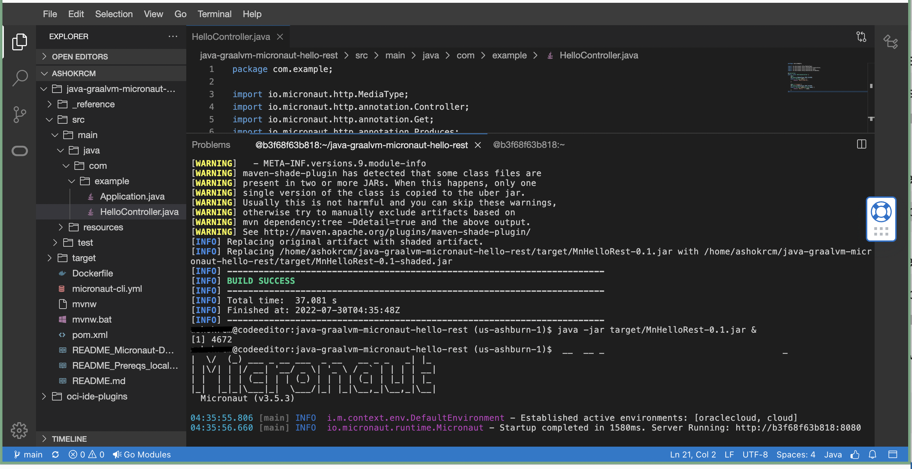

# Micronaut Hello World REST App with GraalVM Enterprise in OCI Code Editor

This sample shows how you can get started quickly with GraalVM Enterprise Edition in Oracle Cloud Infrastructre (OCI) Code Editor. This sample uses a simple hello world REST application built with the Micronaut framework and GraalVM Enterprise Native Image and JDK.

## What is GraalVM?

GraalVM is a high-performance JDK distribution that can accelerate any Java workload running on the HotSpot JVM.

GraalVM Native Image ahead-of-time compilation enables you to build lightweight Java applications that are smaller, faster, and use less memory and CPU. At build time, GraalVM Native Image analyzes a Java application and its dependencies to identify just what classes, methods, and fields are absolutely necessary and generates optimized machine code for just those elements.

GraalVM Enterprise Edition is available for use on Oracle Cloud Infrastructure (OCI) at no additional cost.

## What is Micronaut?

Micronaut is a modern, JVM-based framework to build modular, easily testable microservice and serverless applications. By avoiding runtime reflection in favor of annotation processing, Micronaut improves the Java-based development experience by detecting errors at compile time instead of runtime, and improves Java-based application start time and memory footprint. Micronaut includes a persistence framework called Micronaut Data that precomputes your SQL queries at compilation time making it a great fit for working with databases like MySQL, Oracle Autonomous Database, etc.

Micronaut uses GraalVM Native Image to build lightweight Java applications that use less memory and CPUs, are smaller and faster because of an advanced ahead-of-time compilation technology.

## What is Code Editor?

The Code Editor enables you to edit and deploy code for various OCI services directly from the OCI Console. You can now update service workflows and scripts without having to switch between the Console and your local development environments. This makes it easy to rapidly prototype cloud solutions, explore new services, and accomplish quick coding tasks. 

GraalVM Enterprise JDK 17 (Java Development Kit) and Native Image are preinstalled in Cloud Shell. 

## Step 1 (Open Terminal in Code Editor)

1. [Login to OCI Console and launch Code Editor](https://cloud.oracle.com/?bdcstate=maximized&codeeditor=true).

2. Open the terminal from code editor.

Execute upcoming commands in the terminal prompt.

Note: Alternatively, you can also open cloud shell to execute these commands.

## Step 2 (Prerequisites - One time setup)

1. List the installed JDKs:

    ```shell
    csruntimectl java list
    ```

    The output should be similar to:

    ```shell
      graalvmeejdk-17.0.4                                    /usr/lib64/graalvm/graalvm22-ee-java17
    * openjdk-11.0.15                   /usr/lib/jvm/java-11-openjdk-11.0.15.0.9-2.0.1.el7_9.x86_64
      openjdk-1.8.0.332                /usr/lib/jvm/java-1.8.0-openjdk-1.8.0.332.b09-1.el7_9.x86_64
    ```

2. Select GraalVM as the current JDK:

    ```shell
    csruntimectl java set graalvmeejdk-17.0.4
    ```

    The output should be similar to:

    ```shell
    The current managed java version is set to graalvmeejdk-17.0.4.
    ```

3. Confirm the environment variable `JAVA_HOME` is set correctly:

    ```shell
    echo $JAVA_HOME
    ```

    The output should be similar to:

    ```shell
    /usr/lib64/graalvm/graalvm22-ee-java17
    ```

4. Confirm the environment variable `PATH` is set correctly:

    ```shell
    echo $PATH
    ```

    The output should be similar to:

    ```shell
    /usr/lib64/graalvm/graalvm22-ee-java17/bin/:/ggs_client/usr/bin: ...
    ```

5. Confirm the `java` version:

    ```shell
    java -version
    ```

    The output should be similar to:

    ```shell
    java version "17.0.4" 2022-07-19 LTS   
    Java(TM) SE Runtime Environment GraalVM EE 22.2.0 (build 17.0.4+11-LTS-jvmci-22.2-b05)   
    Java HotSpot(TM) 64-Bit Server VM GraalVM EE 22.2.0 (build 17.0.4+11-LTS-jvmci-22.2-b05, mixed mode, sharing)
    ```

6. Confirm the `native-image` version:

    ```shell
    native-image --version
    ```

    The output should be similar to:

    ```shell
    GraalVM 22.2.0 Java 17 EE (Java Version 17.0.4+11-LTS-jvmci-22.2-b05)
    ```

7. Confirm the `maven` version and `Java` used:

    ```shell
    mvn --version
    ```

    The output should be similar to:

    ```shell
    Apache Maven 3.6.1 (Red Hat 3.6.1-6.3)
    Maven home: /opt/rh/rh-maven36/root/usr/share/maven
    Java version: 17.0.4, vendor: Oracle Corporation, runtime: /usr/lib64/graalvm/graalvm22-ee-java17   
    Default locale: en_US, platform encoding: UTF-8
    OS name: "linux", version: "4.14.35-2047.513.2.2.el7uek.x86_64", arch: "amd64", family: "unix"
    ```

## Step 3 (Setup Project and Run)

***Note: To run this sample on local macOS instead of Code Editor, follow the [Prerequisites on local macOS](./README_Prereqs_local_macOS.md), and skip to the next section [Steps to run a Java application](#step-3-setup-project-and-run).***


1. Clone this GIT repository.

    ```
    git init graalvmee-java-micronaut-hello-rest
    cd graalvmee-java-micronaut-hello-rest
    git remote add origin https://github.com/oracle-devrel/oci-code-editor-samples.git
    git config core. sparsecheckout true
    echo "java-samples/graalvmee-java-micronaut-hello-rest/*">>.git/info/sparse-checkout
    git pull --depth=1 origin main
    ```

    You can now view/change the sample code in code editor.

    

2. Build the app JAR

    ```shell
    mvn package
    ```

    **OR** 

    ```shell
    ./mvnw package
    ```

3. Run the app JAR in the background

    ```shell
    java -jar target/MnHelloRest-0.1.jar &
    ```

    

4. Test the app JAR

    4.1) Should output "Hello World"

    ```shell
    curl http://localhost:8080/
    ```

    4.2) Should output "Hello Micronaut"

    ```shell
    curl http://localhost:8080/Micronaut
    ```

    

5. Bring the running app JAR in the foreground

    ```shell
    fg
    ```

6. Once the app is running in the foreground, press CTRL+C to stop it.

7. Build the app native executable

    ```shell
    export USE_NATIVE_IMAGE_JAVA_PLATFORM_MODULE_SYSTEM=false

    mvn package -Dpackaging=native-image
    ```

    **OR** 

    ```shell
    export USE_NATIVE_IMAGE_JAVA_PLATFORM_MODULE_SYSTEM=false
    
    ./mvnw package -Dpackaging=native-image
    ```

8. Run the app native executable in the background

    ```shell
    ./target/MnHelloRest &
    ```

9. Test the app native executable

    9.1) Should output "Hello World"

    ```shell
    curl http://localhost:8080/
    ```

    9.2) Should output "Hello Micronaut-Graal-Native"

    ```shell
    curl http://localhost:8080/Micronaut-Graal-Native
    ```

10. Bring the running app JAR in the foreground

    ```shell
    fg
    ```

11. Once the app is running in the foreground, press CTRL+C to stop it.

## References
* [Java Graal VM Overview](https://www.oracle.com/in/java/graalvm/)
* [Oracle Graal VM Documentation](https://docs.oracle.com/en/graalvm/enterprise/20/docs/)
* [Micronaut - Microservices and Serverless Application Framework](https://micronaut.io/)
* [Learning from Micronaut-generated Dockerfiles](./README_Micronaut-Dockerfiles.md)

## Contributors
* Author: Sachin Pikle
* Collaborators: Ashok Raja CM
* Last release: July 2022

## Contributing
This project is open source.  Please submit your contributions by forking this repository and submitting a pull request!  Oracle appreciates any contributions that are made by the open source community.

## License
Copyright (c) 2022 Oracle and/or its affiliates.

Licensed under the Universal Permissive License (UPL), Version 1.0.

See [LICENSE](../LICENSE) for more details.

ORACLE AND ITS AFFILIATES DO NOT PROVIDE ANY WARRANTY WHATSOEVER, EXPRESS OR IMPLIED, FOR ANY SOFTWARE, MATERIAL OR CONTENT OF ANY KIND CONTAINED OR PRODUCED WITHIN THIS REPOSITORY, AND IN PARTICULAR SPECIFICALLY DISCLAIM ANY AND ALL IMPLIED WARRANTIES OF TITLE, NON-INFRINGEMENT, MERCHANTABILITY, AND FITNESS FOR A PARTICULAR PURPOSE.  FURTHERMORE, ORACLE AND ITS AFFILIATES DO NOT REPRESENT THAT ANY CUSTOMARY SECURITY REVIEW HAS BEEN PERFORMED WITH RESPECT TO ANY SOFTWARE, MATERIAL OR CONTENT CONTAINED OR PRODUCED WITHIN THIS REPOSITORY. IN ADDITION, AND WITHOUT LIMITING THE FOREGOING, THIRD PARTIES MAY HAVE POSTED SOFTWARE, MATERIAL OR CONTENT TO THIS REPOSITORY WITHOUT ANY REVIEW. USE AT YOUR OWN RISK. 